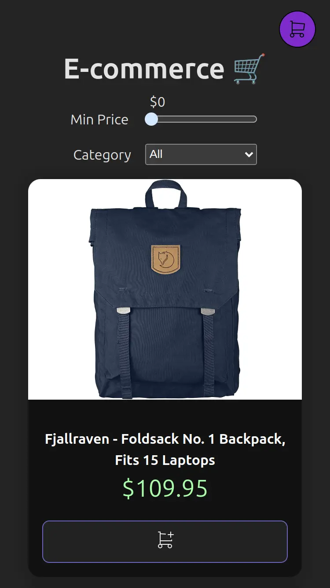

<a id="top"></a>

<h1 align="center"> Buscador de Películas</h1>  

<p align="center">
  <a href="#">
    
  </a>
  <a href="https://opensource.org/licenses/MIT" target="_blank">
    
  </a>
</p>

<div align="center">
    <a href="#-acerca-del-proyecto" target="_blank">
        Acerca Del Proyecto
    </a>
    <span>&nbsp;✦&nbsp;</span>
    <a href="#-vista-previa" target="_blank">
        Vista Previa
    </a>
    <span>&nbsp;✦&nbsp;</span>
    <a href="#-características" target="_blank">
        Características
    </a>
    <span>&nbsp;✦&nbsp;</span>
    <a href="#-tecnologías" target="_blank">
        Tecnologías
    </a>
    <span>&nbsp;✦&nbsp;</span>
    <a href="#-cómo-empezar" target="_blank">
        Cómo Empezar
    </a>
    <span>&nbsp;✦&nbsp;</span>
    <a href="#-comandos" target="_blank">
        Comandos
    </a>
    <span>&nbsp;✦&nbsp;</span>
    <a href="#-contribuciones" target="_blank">
        Contribuciones
    </a>
    <span>&nbsp;✦&nbsp;</span>
    <a href="#-licencia" target="_blank">
        Licencia
    </a>
    <span>&nbsp;✦&nbsp;</span>
    <a href="#-Soporte" target="_blank">
        Soporte
    </a>
</div>
<br>

>Si quieres leer este readme en **inglés**:
>- [**README en Inglés**](https://github.com/joserafael0160/E-commerce/blob/main/README.md)

## 📜 Acerca Del Proyecto
Bienvenido a nuestro E-commerce: En nuestro sitio, puedes explorar una amplia variedad de productos, desde ropa de hombre y mujer hasta equipos electrónicos y joyería. 

¿Buscas algo específico? Utiliza nuestros filtros por categoría o precio mínimo para encontrar lo que necesitas. 

¡Disfruta de la comodidad de comprar en línea y descubre todo lo que tenemos para ofrecerte! 💻🛒


<p align="right">(<a href="#top" >Volver al inicio 🔝</a>)</p>

## 👀 Vista previa
<h4>En un iPhone SE (375x667)</h4>


<p align="right">(<a href="#top">Volver al inicio 🔝</a>)</p>

¡Claro! Aquí tienes una descripción de las características que has implementado en tu buscador de películas con React:

## 💬 Características
 - **Soporte de Favicon**: Se ha añadido soporte para una amplia v dad de tamaños de favicon, asegurando que el ícono del sitio se muestre correctamente en todos los dispositivos y plataformas.

 - **Etiquetas Open Graph y Twitter**: Se han incluido etiquetas meta de Open Graph y Twitter, lo que optimiza la vista previa del sitio web en plataformas sociales como Facebook y Twitter.

 - **Compatibilidad entre navegadores**: La página web utiliza la etiqueta meta `X-UA-Compatible`, que garantiza la compatibilidad con varios navegadores, especialmente versiones antiguas de Internet Explorer.

 - **Mostrar una lista de productos desde un JSON**: He creado una interfaz para mostrar una lista de productos que provienen de un archivo JSON. Esto permite a los usuarios ver los productos disponibles en la tienda.

 - **Diseño de cuadrícula responsive**: En esta aplicación, los productos se mostrarán en filas y columnas, ajustándose para verse bien tanto en pantallas grandes como en dispositivos móviles.

 - **Filtrar por categoría**: Se implementó un filtro que permite a los usuarios seleccionar una categoría específica (por ejemplo, “Jewelery”, “Electronics”, etc.). Al aplicar el filtro, la lista de productos se actualiza para mostrar solo los productos de esa categoría.

 - **Filtrar por precio**: Agregé la funcionalidad de filtrar productos por rango de precios. Los usuarios pueden establecer un mínimo, y la lista de productos se ajusta automáticamente para mostrar solo los productos dentro de ese rango.


 - **Uso de useContext para evitar pasar props innecesarios**: Utilizar useContext para administrar el estado global de la aplicación. Esto evita la necesidad de pasar props manualmente entre componentes y mejora la eficiencia.
 
 - **Carrito de compras**: 
1. **Agregar productos al carrito:**
   - Se ha implementado la capacidad de agregar productos al carrito desde la lista de productos. Los usuarios pueden hacer clic en un botón para agregar al carrito y el producto se agrega a su selección.

2. **Eliminar productos del carrito:**
   - Los usuarios pueden eliminar productos del carrito si cambian de opinión o si ya no desean comprar un artículo específico.

3. **Modificar la cantidad de productos en el carrito:**
   - Se ha implementado la funcionalidad para que los usuarios puedan ajustar la cantidad de un producto en el carrito. Esto es útil si desean comprar más o menos unidades de un artículo.

4. **Sincronización de cambios en el carrito con la lista de productos:**
   - Cuando los usuarios agregan o eliminan productos del carrito, los cambios se reflejan automáticamente en la lista de productos. Esto garantiza una experiencia coherente para los usuarios.

5. **Guardar el carrito en localStorage:**
   - Al guardar el carrito en el almacenamiento local (localStorage), los usuarios pueden recuperar su selección incluso después de recargar la página. Esto mejora la usabilidad y la comodidad.


<p align="right">(<a href="#top">Volver al inicio 🔝</a>)</p>


## 🧰 Tecnologías utilizadas
- [**React**](https://reactjs.org/) - Una biblioteca de JavaScript para construir interfaces de usuario interactivas.
- [**Vite**](https://vitejs.dev/) - Un entorno de desarrollo rápido y ligero para aplicaciones web modernas.
- [**ESLint**](https://eslint.org/) - Una herramienta de código abierto que te ayuda a encontrar y corregir problemas en tu código JavaScript.

<p align="right">(<a href="#top">Volver al inicio 🔝</a>)</p>


## 🚀 Cómo Empezar
1. **Haz un Fork** o clona este repositorio

```bash
git clone git@github.com:joserafael0160/E-commerce.git
```

2. Instala las dependencias:

- Usé [**bun**](https://bun.sh) para instalar y gestionar las dependencias.
  
```bash
## Instala bun para MacOS, WSL & Linux:
curl -fsSL https://bun.sh/install | bash

# Instala bun para Windows:
powershell -c "iwr bun.sh/install.ps1|iex"

# Instala con bun:
bun install
```

- o puedes usar [**pnpm**](https://pnpm.io):

```bash
# Instala pnpm globalmente si no lo tienes:
npm install -g pnpm

# Instala las dependencias:
pnpm install
```

3. Ejecuta el servidor de desarrollo:

```bash
# Ejecuta con bun:
bun run dev

# Ejecuta con pnpm:
pnpm run dev
```

<p align="right">(<a href="#top">Volver al inicio 🔝</a>)</p>

## 🧞 Comandos
|      | Comando   | Acción                                         |
| :--- | :-------- | :-------------------------------------------- |
| ⚙️    | `dev`     | Inicia el servidor de desarrollo local.           |
| ⚙️    | `build`   | Genera la versión de producción en `./dist/`.    |
| ⚙️    | `lint`    | Ejecuta ESLint para encontrar problemas en tu código JavaScript. |
| ⚙️    | `preview` | Muestra una vista previa de la versión local.                      |
| ⚙️    | `predeploy` | Genera la versión de producción antes de implementarla. |
| ⚙️    | `deploy`  | Implementa el sitio en GitHub Pages desde la carpeta `dist`. |

<p align="right">(<a href="#top">Volver al inicio 🔝</a>)</p>

## 🤝 Contribuciones

¡Las contribuciones son siempre bienvenidas! Ya sea que estés informando errores, solicitando nuevas funciones o mejorando las funcionalidades existentes, tu ayuda es **muy apreciada**.

Si tienes alguna sugerencia que podría mejorar el proyecto, por favor haz un [_fork_](https://github.com/joserafael0160/E-commerce/fork) del repositorio y crea una [_pull request_](https://github.com/joserafael0160/E-commerce/pulls). También puedes simplemente abrir un [_issue_](https://github.com/joserafael0160/E-commerce/issues) con la etiqueta "enhancement".

Aquí tienes una guía rápida:

1. Haz un [_fork_](https://github.com/joserafael0160/E-commerce/fork) del Proyecto
2. Clona tu [_fork_](https://github.com/joserafael0160/E-commerce/fork) (`git clone <URL del fork>`)
3. Añade el repositorio original como remoto (`git remote add upstream <URL del repositorio original>`)
4. Crea tu Rama de Funcionalidad (`git switch -c feature/NuevaFuncionalidad`)
5. Realiza tus Cambios (`git commit -m 'Add: alguna NuevaFuncionalidad'`)
6. Haz Push a la Rama (`git push origin feature/NuevaFuncionalidad`)
7. Abre una [_pull request_](https://github.com/joserafael0160/E-commerce/pulls)

<p align="right">(<a href="#top">Volver al inicio 🔝</a>)</p>

## 🔑 Licencia
[MIT](https://github.com/joserafael0160/E-commerce/blob/main/LICENSE)

<p align="right">(<a href="#top">Volver al inicio 🔝</a>)</p>

## 🙏 Soporte
No olvides dejar una estrella ⭐️

<p align="right">(<a href="#top">Volver al inicio 🔝</a>)</p>

<br>
<hr>
<p align="center">✌️</p>
<p align="center">
<sub><sup>Un proyecto creado por <a href="https://github.com/joserafael0160">@joserafael0160</a></sup></sub>